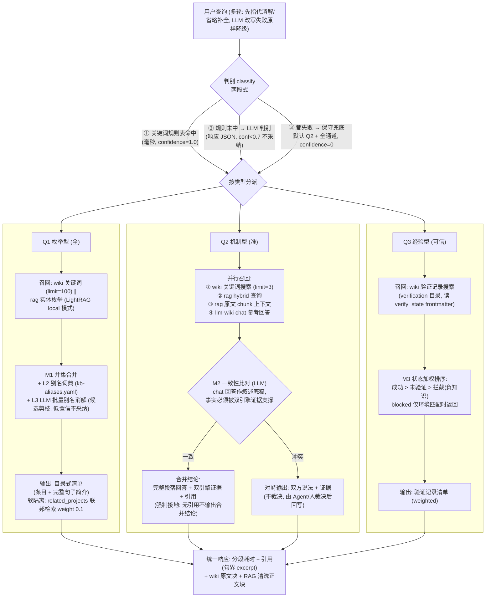

# Crucible 查询管线流程图 (Q1/Q2/Q3 判别 → 检索 → 合并)

## 关键设计点

| 环节 | 技术细节 |
|---|---|
| 判别两段式 | 规则正则先行（高频句式约七成, 零 LLM）→ LLM 兜底（低置信不采纳）→ 保守策略（默认 Q2 全通道, 判不准不硬判） |
| 检索通道 | wiki = 关键词+图（llm-wiki search.rs port, 向量腿待接通）；rag = 向量+实体图（LightRAG）；chat 参考 = llm-wiki 完整回答作叙述底稿 |
| M1 并集 | 名字归一化 + L2 词典（人工确认等价）+ L3 LLM 批量判定（候选剪枝 ≤40 对, confidence≥0.7 才采纳） |
| M2 一致性 | 三输入（wiki 结论 + rag 结论 + chat 底稿）→ LLM 只比对不重写；一致才出合并结论且强制带引用（宁缺毋滥守 faithfulness）；冲突不裁决 |
| M3 状态排序 | verify_state 四态加权（success/blocked/unverified/false_positive），blocked 只在环境匹配时呈现 |
| 软隔离 | 项目默认隔离；related_projects 声明后联邦检索 weight 0.1，只进参考区不进主结果 |
| 引用层 | wiki 引用 = 整页原文句界 excerpt（剥 frontmatter）；rag 引用 = chunk 清洗正文；所有结论带来源，无来源降级 unverified |
